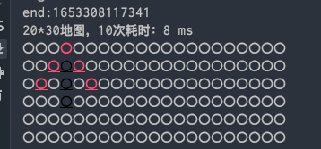

# 更新计划
- 转为maven项目
- 添加基准测试

# 备忘

(2,2)是第一个最优节点，最后的路径是怎么找到右上角(2,1)节点的？

每次分析最优节点时，都会把该节点从openList移动到closeMap，分析完之后，再从剩下的openList中找下一个最优点

虽然(2,2)是第一次分析的最优点，但会被加入到closeMap，下次分析时(2,1)是openList中的是最优点。
且(2,1)的父节点是起点(1,2)，所以最后回溯法绘制路径就得到了这个路径
