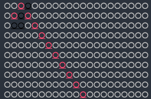

> 源于 [ClaymanTwinkle/astar] (https://github.com/ClaymanTwinkle/astar)
> 
> 起初只是修复了原项目的bug：
> - 见[CSDN:Astart的大多Java实现都没有计入曼哈顿值的代价](https://blog.csdn.net/qq_43413788/article/details/108630704)
> - issue：[issue#1](https://github.com/ClaymanTwinkle/astar/issues/1)
> - issue：[issue#3](https://github.com/ClaymanTwinkle/astar/issues/3)
> 
> 并进行了一些效率优化等

使用示例：`Main.java`

==推荐阅读==：[A星算法详解(个人认为最详细,最通俗易懂的一个版本)](https://blog.csdn.net/hitwhylz/article/details/23089415)  
这篇文章不仅表述了A*寻路的原理，还包含了具体使用场景中的一些问题

注意：A*寻路算法是为了解决起点到终点的路径规划问题，它能有效地找到一条可行的路径，但这条路径并不一定是最短的。
所以如果你在实际使用中，找到了一条不同于结果的更短更快的路线时也不需要因此而惊讶

游戏开发交流群：'300567032'

---

# 关于"穿越墙角"

当前没有"绕过墙角"的处理

如下路径就是"穿越墙角"，当有墙存在时，可以在墙角处斜着寻路 

以后有时间会增加"穿越墙角"和"绕过墙角"的可选模式